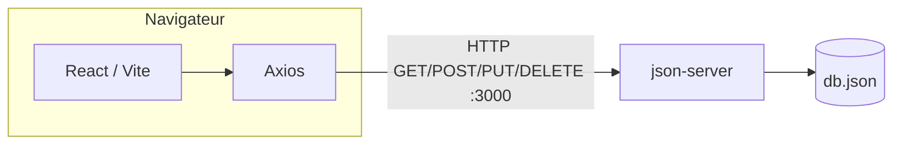

# TP4 — Material UI, React-Bootstrap, architecture & réponses

Branche Git : **`TP4`**.  
Dans ce projet, l’UI principale utilise **MUI** (`HeaderMUI`, `LoginMUI`). Les variantes **Bootstrap** (`HeaderBS`, `LoginBS`) sont fournies pour comparaison : remplacez les imports dans `App.tsx`, `Dashboard.tsx` et `ProjectDetail.tsx` pour les tester.

---

## Partie 1 — Header MUI

- Dépendances : `@mui/material`, `@emotion/react`, `@emotion/styled`, `@mui/icons-material`
- Fichier : `src/components/HeaderMUI.tsx`

### Q1 — Combien de lignes de CSS pour le Header MUI ? Comparaison avec `Header.module.css`

| Source | Fichier CSS dédié au header | Lignes (indicatif) |
|--------|-----------------------------|--------------------|
| **Header MUI** | Aucun (styles via `sx={{ ... }}` sur les composants MUI) | **0** ligne dans un `.css` / `.module.css` pour ce composant |
| **Header CSS Modules** | `src/components/Header.module.css` | **68** lignes au total dans le fichier (règles + media / états) |

**Remarque :** avec MUI, le « CSS » est surtout **inline dans le TSX** (`sx`, thème). On ne crée pas de fichier séparé pour le header, ce qui réduit les fichiers à maintenir mais déplace le style dans le code composant.

---

## Partie 2 — Login MUI

- Fichier : `src/features/auth/LoginMUI.tsx`
- Même logique métier que l’ancien `Login` (Axios, `useAuth`, redirection si déjà connecté avec `replace: true`).

**Note du sujet :** aucun fichier CSS dédié au login MUI ; tout passe par `sx` / props MUI.

---

## Partie 3 — Header  Bootstrap

- Dépendances : `react-bootstrap`, `bootstrap`
- Import global dans `src/main.tsx` : `import 'bootstrap/dist/css/bootstrap.min.css';`
- Fichier : `src/components/HeaderBS.tsx`

### Q2 — Header MUI vs Bootstrap : lisibilité, longueur

| Critère | Observation |
|---------|-------------|
| **Lisibilité** | **Bootstrap :** JSX très plat, beaucoup de sens porté par les classes utilitaires (`ms-auto`, `fw-bold`) — familier si on connaît Bootstrap. **MUI :** structure sémantique (`AppBar`, `Toolbar`) très lisible, styles concentrés en `sx`. |
| **Longueur** | Les deux versions sont **courtes**. MUI a un peu plus d’imports de primitives ; Bootstrap s’appuie sur le CSS global déjà chargé. |

Choix subjectif : MUI si on veut un **design system** cohérent et typé ; Bootstrap si on veut aller vite avec des **classes** connues.

---

## Partie 4 — Login Bootstrap

- Fichier : `src/features/auth/LoginBS.tsx` (même `handleSubmit` / états que `LoginMUI`).

### Q3 — `sx={{}}` (MUI) vs `className` (Bootstrap)

- **MUI `sx` :** styles **colocalisés** au composant, accès au thème (breakpoints, palette), typage côté TS selon config ; le bundle inclut le runtime Emotion.
- **Bootstrap `className` :** styles **découplés** dans une feuille globale ; très rapide pour des grilles / utilitaires ; personnalisation fine peut devenir verbeuse ou nécessiter du SCSS.

**Préférence (exemple de réponse personnelle à adapter) :** MUI pour une app React entièrement « composant + thème » ; Bootstrap pour prototyper ou si l’équipe maîtrise déjà Bootstrap.

---

## Partie 5 — Tableau comparatif (après tests)

| Critère | Material UI | React-Bootstrap |
|---------|-------------|-----------------|
| **Installation** | Plusieurs paquets (`@mui/material`, emotion, icons) | `react-bootstrap` + `bootstrap` + import CSS |
| **Nombre de composants utilisés (login + header)** | Élevé (primitives granulaires : `TextField`, `Alert`, `AppBar`…) | Modéré (`Navbar`, `Card`, `Form`…) |
| **Lignes de CSS écrites** | ~0 fichier dédié (usage de `sx` / thème) | ~0 fichier custom (surtout classes + `style={{}}` ponctuel) |
| **Système de style** | `sx` + thème MUI + Emotion | Classes Bootstrap + CSS global |
| **Personnalisation couleurs** | `sx`, `theme`, `palette` | Variables SCSS Bootstrap ou `style` / classes custom |
| **Responsive** | `sx` avec breakpoints (`xs`, `sm`…) | Classes responsive Bootstrap (`col-md-*`, etc.) |
| **Lisibilité du code** | Très structuré, verbeux sur les props | Compact si on connaît les classes |
| **Documentation** | Très fournie, nombreux exemples | Solide, proche de Bootstrap officiel |
| **Votre préférence** | *(à compléter après vos tests)* | *(à compléter après vos tests)* |

### Q4 — Une seule librairie pour TaskFlow en production ?

**Réponse type (à personnaliser) :** **Material UI** si l’objectif est un produit sur le long terme avec thème, accessibilité et composants avancés homogènes. **React-Bootstrap** si la charte suit déjà Bootstrap, équipe habituée, ou besoin d’un bundle plus léger que MUI+icons selon usage. Éviter de **mixer** les deux sur la même page (double système de style, poids du bundle).

---

## Partie 6 — Architecture base de données

### Schéma actuel (React + Axios + json-server)

Ports utilisés dans ce repo : **Vite `5173`**, **json-server `3000`** (le sujet peut mentionner `4000` comme exemple ; l’important est le principe).

### a) Si `json-server` est remplacé par **Firebase**

`React → SDK Firebase (client) → services Firebase (Auth, Firestore, etc.)`

Le SDK gère HTTPS et les règles de sécurité côté console Firebase ; pas besoin de ton propre serveur Node pour les cas simples.

### b) Si remplacé par **Express + MongoDB**

`React → Axios → API Express (Node) → MongoDB`

Le backend Express centralise la logique métier, l’authentification sécurisée et l’accès à la base.

### Q5 — Pourquoi React ne peut pas se connecter directement à MySQL ?

React s’exécute **dans le navigateur** du client. Une base MySQL attend des connexions **serveur** (protocole, identifiants, réseau). Exposer MySQL au navigateur serait **dangereux** (fuite d’identifiants, pas de contrôle d’accès). Il faut une **couche intermédiaire** (API) entre le client et la base.

### Q6 — Trois raisons de ne pas utiliser `json-server` en production

1. **Pas conçu pour la prod** : pas d’auth robuste, pas de validation métier, pas de scalabilité.
2. **Persistance fichier JSON** : pas adapté à la concurrence forte, backups, transactions comme une vraie BDD.
3. **Sécurité** : règles CORS / exposition ; pas de modèle de permissions fin comme sur un backend dédié.

### Q7 — Pourquoi Firebase « direct » depuis React est possible, pas MySQL ?

Firebase expose une **API sécurisée** (HTTPS) et des **règles de sécurité** (Firestore / Storage) pensées pour un accès **depuis le client** avec jetons / auth. Ce n’est pas une connexion JDBC brute : c’est un **BaaS**. MySQL, lui, est une base **privée** derrière un serveur ; le navigateur n’y accède pas directement.

---

## Partie 7 — Questions de réflexion

### Q8 — Passer TaskFlow avec de vrais utilisateurs en production (au lieu de json-server)

1. Remplacer json-server par une **API** (Node/Express, Nest, etc.) ou BaaS (Firebase, Supabase…).
2. **Authentification** réelle (hash mots de passe, JWT / sessions, OAuth si besoin).
3. **Base de données** managée (PostgreSQL, MongoDB Atlas…) avec sauvegardes.
4. **HTTPS**, domaine, hébergement front (Vercel, Netlify…) et back.
5. Variables d’environnement pour **URL API**, secrets, **CORS** strict.
6. Monitoring, logs, rate limiting, conformité RGPD si données perso.

### Q9 — Risques de dépendre de MUI / Bootstrap

- **Taille du bundle** : MUI + icons peut être lourd ; Bootstrap charge tout le CSS global si on n’optimise pas (tree-shaking partiel selon usage).
- **Mises à jour** : breaking changes entre versions majeures ; dette de migration.
- **Verrouillage** : styles et patterns liés à la lib ; remplacer coûte cher.

### Q10 — App de chat temps réel : json-server, Firebase ou backend custom ?

- **json-server :** **non** — pas de WebSocket / push temps réel adapté.
- **Firebase :** **oui** pour un MVP (Firestore realtime, présence) avec règles bien configurées.
- **Backend custom (Node + Socket.io / WebSocket + Redis) :** **oui** pour contrôle total, charge, fonctionnalités avancées.

**Choix typique :** Firebase pour aller vite ; **backend custom** si besoin de logique métier complexe ou d’hébergement souverain.
